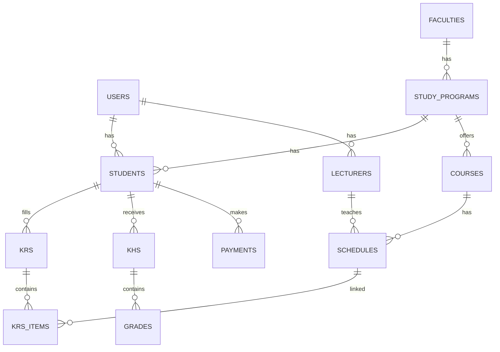

# 📚 Database Best Practices

## 🛠️ Penamaan & Struktur Tabel
- **Gunakan nama tabel dalam bentuk jamak** (`students`, `lecturers`) untuk konsistensi.
- **Snake_case** untuk nama kolom dan tabel.
- **Gunakan primary key dengan tipe UUID atau big integer autoincrement** (`id`).
- Setiap tabel wajib memiliki kolom:
  - `id` (PK)
  - `created_at` & `updated_at` (timestamp)
  - `deleted_at` (nullable, untuk soft delete jika diperlukan).

**Contoh:**
```sql
CREATE TABLE students (
    id BIGSERIAL PRIMARY KEY,
    user_id BIGINT NOT NULL REFERENCES users(id),
    nim VARCHAR(20) UNIQUE NOT NULL,
    program_studi_id BIGINT NOT NULL REFERENCES study_programs(id),
    angkatan SMALLINT NOT NULL,
    status VARCHAR(20) DEFAULT 'active',
    created_at TIMESTAMP DEFAULT NOW(),
    updated_at TIMESTAMP DEFAULT NOW()
);
```

---

## 📐 Entity Relationship Design (ERD)

### Tabel Inti & Relasi
| Tabel              | Deskripsi | Relasi |
|--------------------|-----------|--------|
| **users**          | Data pengguna (mahasiswa, dosen, admin) | 1 → 1 ke `students`/`lecturers` |
| **students**       | Data mahasiswa | 1 → N ke `krs`, `khs`, `payments` |
| **lecturers**      | Data dosen | 1 → N ke `schedules` |
| **faculties**      | Data fakultas | 1 → N ke `study_programs` |
| **study_programs** | Data program studi | 1 → N ke `students`, `courses` |
| **courses**        | Data mata kuliah | 1 → N ke `schedules`, N → N ke `courses` (prerequisites) |
| **schedules**      | Jadwal kuliah | 1 → N ke `krs_items` |
| **krs**            | Kartu Rencana Studi | 1 → N ke `krs_items` |
| **krs_items**      | Detail mata kuliah di KRS | FK ke `schedules` |
| **khs**            | Kartu Hasil Studi | 1 → N ke `grades` |
| **grades**         | Nilai per mata kuliah | FK ke `courses` |
| **payments**       | Data pembayaran mahasiswa | FK ke `students` |

---

## 📝 Best Practice Penggunaan Database

### 1. **Normalisasi Data**
- Gunakan minimal **3rd Normal Form (3NF)** untuk menghindari duplikasi.
- Simpan data yang bisa berubah di tabel terpisah (misalnya status mahasiswa di tabel `students_status` jika perlu historinya).

### 2. **Indexing**
- Index kolom yang sering digunakan di `WHERE`, `JOIN`, atau `ORDER BY`.
- Gunakan **composite index** jika query sering menggabungkan lebih dari satu kolom.

**Contoh:**
```sql
CREATE INDEX idx_students_nim ON students(nim);
CREATE INDEX idx_schedules_course_lecturer ON schedules(course_id, lecturer_id);
```

### 3. **Foreign Key & Referential Integrity**
- Gunakan **ON DELETE CASCADE** untuk data yang harus ikut terhapus.
- Gunakan **ON DELETE SET NULL** jika data tetap relevan meski parent terhapus.

**Contoh:**
```sql
FOREIGN KEY (program_studi_id) REFERENCES study_programs(id) ON DELETE CASCADE
```

### 4. **Soft Delete**
- Gunakan `deleted_at` untuk soft delete, jangan langsung hapus data penting.
- Tambahkan filter `WHERE deleted_at IS NULL` pada query utama.

### 5. **Enum & Lookup Table**
- Gunakan `ENUM` untuk status terbatas (`active`, `inactive`, `graduated`) atau tabel lookup jika datanya bisa bertambah.

### 6. **Audit Trail**
- Simpan riwayat perubahan data penting (misalnya nilai, status mahasiswa) di tabel log.

### 7. **Optimasi Query**
- Gunakan `EXPLAIN` untuk mengecek performa query.
- Hindari `SELECT *`, pilih kolom yang dibutuhkan saja.

---

## 📊 Contoh Skema Ringkas


